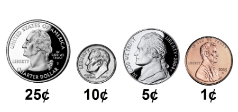

<h1>Ambitious Algorithm</h1>

<b>TASK:</b> Create an algorithm that receives a value of change and returns the smallest quantity of coins we can use.

Coins available: 

 

<b>Context:</b> According to the <a href="https://www.nist.gov/" type="_blank">National Institute of Standards and Technology (NIST)</a>, an ambitious algorithm is one <i> “that always takes the immediate, or local, best solution while finding an answer"</i>. Ambitious algorithms find the general or globally optimal solution for some optimization problems, but may find less-than-optimal solutions for some instances of other problems.

