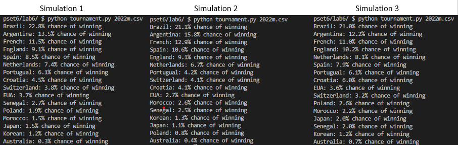

<h1>World Cup Simulation</h1>

<b>TASK:</b> Create an algorithm that receives as input a .csv file containing the rating for all teams playing the round of 16 on a World Cup, and return the probability of each team to win the tournament.

<b>Rules:</b>
<ul>
<li>The .csv file must be passed as command line argument: <i>python tournament.py fileName.csv </i>;</li>
<li>The probability of a team1 winning against a team2 is given by the following equation: <i> 1 / (1 + 10 ** ((rating2 - rating1) / 600)) </i>;</li>
</ul> 

 

<b>CONTEXT:</b> Using the <a href="https://www.fifa.com/fifa-world-ranking/men?dateId=id13471" type="_blank"> FIFA's ranking</a> we can have a way to measure and compare teams. It was introduced in December 1992 and eight teams (including Brazil) have held the top positions.

As an example, using the .csv file containing the rankings from the teams playing in the round 16 of 2022 World Cup, the three simulations above show the output of the algorithm.

