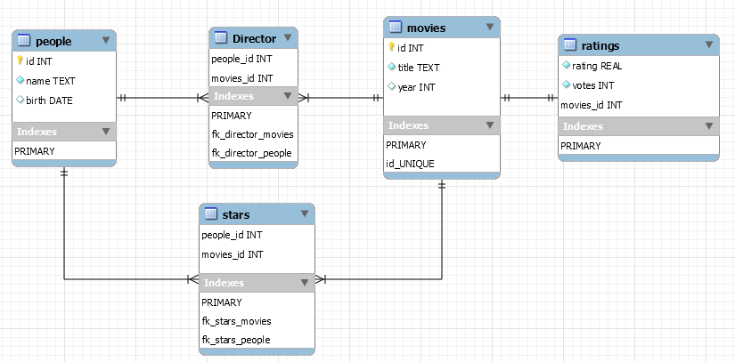

<h1>Dealing with IMDb movies database</h1>

<b>TASK:</b> Create diferent SQL queries for each information asked below, based on the movies.db database file. The queries must be written in diferent .sql files and produce a .txt output with the answers for each query.

<b>Queries:</b>
<ol>
<li>Find the titles for all movies released on 2008;</li>
<li>Find the year that Emma Stone was born;</li>
<li>Find the titles for all movies released at 2018 or after that, listend in alphabetical order;</li>
<li>Find the number of movies with IMDb rating of 10.0;</li>
<li>Find the titles and released year for all Harry Potter movies, listed in cronologycal order;</li>
<li>Find the average rating for all movies released in 2012;</li>
<li>Find the titles and ratings for all movies released in 2010, ordered by rating or alphabetically;</li>
<li>Find names of all people that stared Toy Story;</li>
<li>Find the names of all people that stared a movie released in 2004, ordered by people's born day;</li>
<li>Find the names of all people who directed a movie with a rating of at least 9.0;</li>
<li>Find the titles of the 5 best movies (according to their ratings) that Chadwick Boseman stared;</li>
<li>Find the titles of all movies that Johnny Depp and Helena Bonham Carter stared together;</li>
<li>Find the names of all people that stared in a movie which Kevin Bacon also stared;</li>
</ol> 

 

<b>INSTRUCTIONS:</b> Using the <a href="https://www.imdb.com/" type="_blank"> IMDb database </a> we can make diferent queries to find useful informations more quickly.

 Using <i>cat fileName.sql | sqlite3 movies.db > outputN.txt</i> on the terminal we can execute the query on 'fileName.sql' and write the results on the 'outputN.txt' file.

Make sure to check how the database file was created, using the command <i>.schema</i> or <i>.tables</i> on the SQlite3 terminal.

The image below represents a simple modelling of the database file created on the MySQL Workbench.

