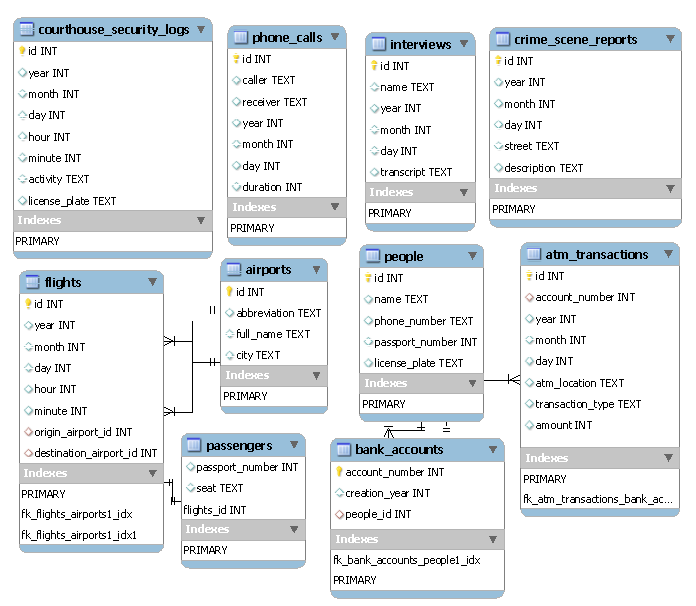

<h1>Crime Solving on Fiftyville</h1>

<b>TASK:</b> The CS50 duck was stolen in Fiftyville. Use the database provided to find who is the thief, who is its accomplice and to which city the thief skaped to.

<b>What do we know:</b>
<ul>
<li>The crime happened on July 28 of 2020, at Chaberlin Street;</li>
<li>The authorities got some datas from the city to help, they are all on the fiftyville.db file;</li>
<li>First take a look on how the database was created, then make its model to see how entities are connected;</li>
<li>The file log.sql must contain the queries used and also the step-by-step solution of the case;</li>
<li>The file answers.txt must contain the answers to the crime;</li>
<li>Queries must be done using the terminal from SQLite3;</li>

The image below represents a simple modelling of the database file created on the MySQL Workbench.

