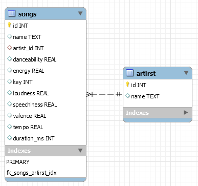

<h1>Dealing with songs informations' database</h1>

<b>TASK:</b> Create diferent SQL queries for each information asked below, based on the songs.db database file. The queries must be written in diferent .sql files and produce a .txt output with the answers for each query.

<b>Queries:</b>
<ol>
<li>Find the titles for all songs in the database;</li>
<li>Find the titles for all songs in the database, in increase time order;</li>
<li>Find the titles of the top five songs with larger duration, in decreased order of duration;</li>
<li>Find the titles of any song with danceability, energy and valence bigger than 0,75;</li>
<li>Find the average energy of all songs in the database;</li>
<li>Find the titles for all songs by Post Malone;</li>
<li>Find the average energy of all Drake's songs;</li>
<li>Find the titles for all songs with a feat. artist;</li>

 

<b>INSTRUCTIONS:</b> Using a sample of a <a href="https://www.kaggle.com/" type="_blank"> Kaggle database </a> we can make diferent queries to find useful informations more quickly.

 Using <i>cat fileName.sql | sqlite3 songs.db > outputN.txt</i> on the terminal we can execute the query on 'fileName.sql' and write the results on the 'outputN.txt' file.

Make sure to check how the database file was created, using the command <i>.schema</i> or <i>.tables</i> on the SQlite3 terminal.

The image below represents a simple modelling of the database file created on the MySQL Workbench.

