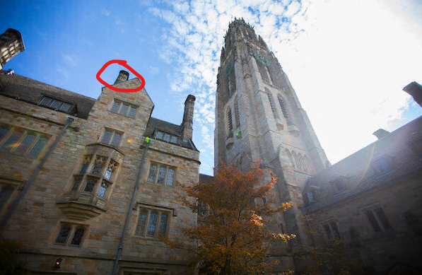
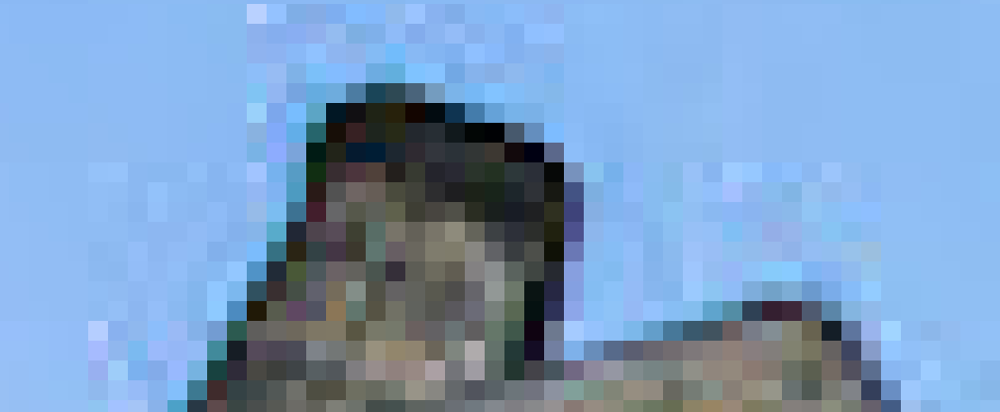
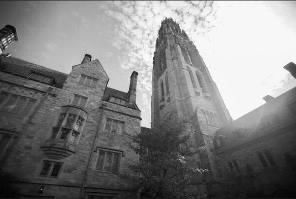
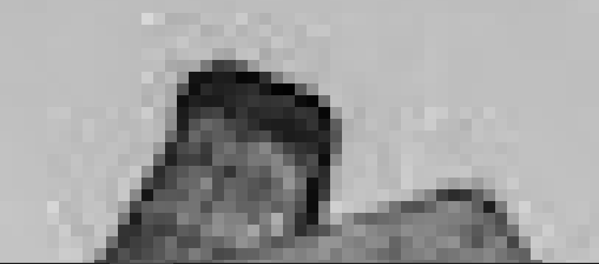
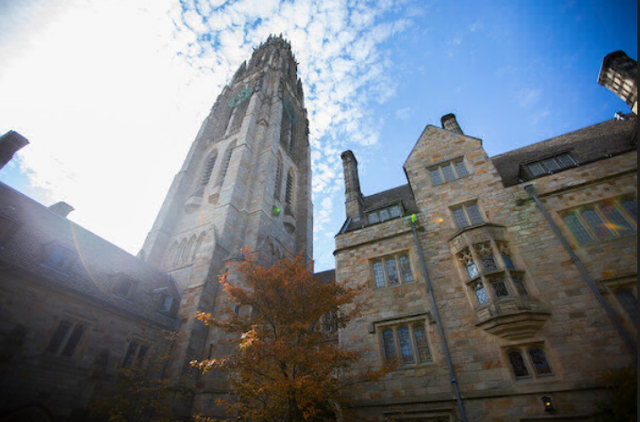
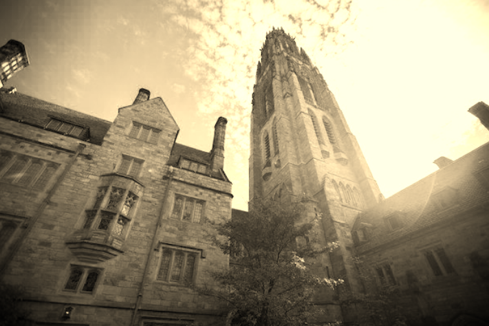
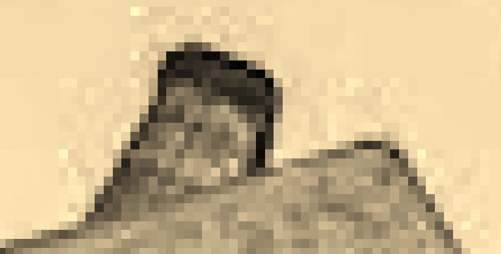
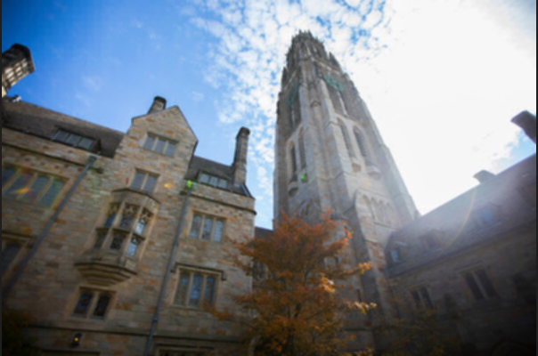
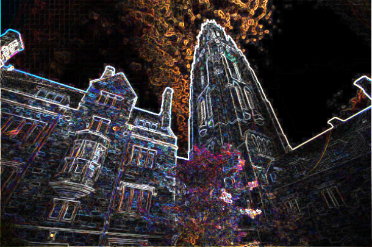
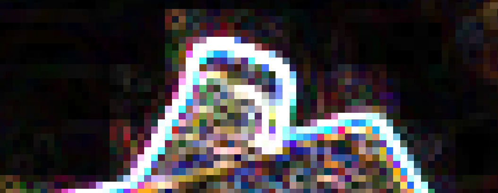

<h1>Developing filters for images</h1>

<b>TASK:</b> Create an algorithm - in C language - able to apply different filters to BMP images (considering images of 24-bit uncompressed BMP 4.0).

<h2>Context:</h2>

 In order to apply filters to an image, we must look to a picture as its individual pixels. In the end, our computers see an image as a matrix of pixels, each pixel with its own color value (for example, RGB values) and in a specific position. When putted all together, the pixels form the final image we see. So, acessing each pixel and changing its RGB value, or even its position, is a way of creating a <a href="https://lodev.org/cgtutor/filtering.html" target="_blank">filter algorithm</a>. 

A BMP image of 24 bits uses 8 bits to indicate the amount of each RGB value (that's why it goes from 0 to 255). So a bmp file contains sequences of 24bit (pixels) that when combined form the final image. It also contains some header with important informations about the file. The first header is the BITMAPFILEHEADER, with 14 bytes. The second one is the  BITMAPINFOHEADER  with 40 bytes. After them we have the real bitmap - a pixel matrix.

<ul>
<li><b>Gray Scale:</b> The basis of this filter is to understand that an RGB value of a pixel is a mix of three colors value: red, green and blue. When all these colors have the same value (from black(0) to white (255)) they form a gray color, which can be darker (all values equals and next to 0) or lighter (all values equals and next to 0)</li>  
<li><b>Reflect:</b> This is similar to looking at a mirror, where the pixels from the same vertical line will be swapped horizontally.</li> 
<li><b>Sepia:</b> This is the classic old time filter, with its pixels' color values adjusted to the sepia scale, according to the following equations:

$$ sepiaRed = 0.393 * originalRed + 0.769 * originalGreen + 0.189 - originalBlue $$
$$ sepiaGreen = 0.349 * originalRed + 0.686 * originalGreen + 0.168 - originalBlue $$
$$ sepiaBlue = 0.272 * originalRed + 0.534 * originalGreen + 0.131 - originalBlue $$
    
</li> 
<li><b>Blur:</b> This filter literally blurs images, adjusting its pixel's color values in a way that the distinguish from one object to the other is minimized. In order to do that, we often set its value by taking the average colors of the pixel's squad (3x3), called <i>box blur</i>. </li> 
<li><b>Edges:</b> This filters aims to highlight objects' edges. To be able to manipulate an edge, we must first detect an edge. In this context, an edge means that we have a significant change in colors (it can be horizontally or vertically). The <i>Sobel</i> operator may help with that, giving two <i>Kernels</i> we can use to detect the edges: Gx and Gy (see in code).</li>
</ul>

This exercise already contains some code files implemented: 

<ul>
<li>Makefile: this is simple a file that specifies what the compiler must do once we run the code;</li> 
<li>bmp.h: contains functions BITMAPFILEHEADER e BITMAPINFOHEADER and a struct called RGBTRIPLE, to store the values for the RGB parameters.</li> 
<li>main.c: this code is already done, being responsible to control the main functions of the algorithm (open and close files, calling the filter function, etc.).</li> 
<li>helpers.h: contains functions prototypes.</li> 
<li>herlpers.c: this is the file I must implement, with the algorithms of the filters' functions.
</ul>

 <h2>Examples:</h2> 

To better understand the changes in individuals pixels, I'll leave here an example of the result for each filter algorithm and also a focused part of the image (marked in the original one), able to show the different pixels.

<ul>
<li>Original Image:  
 
</li> 
<li>Gray Scale:  
 
</li> 
<li>Reflect:  
 
</li> 
<li>Sepia:  
 
</li> 
<li>Blur:  
 
</li> 
<li>Edge:  
 
</li> 

