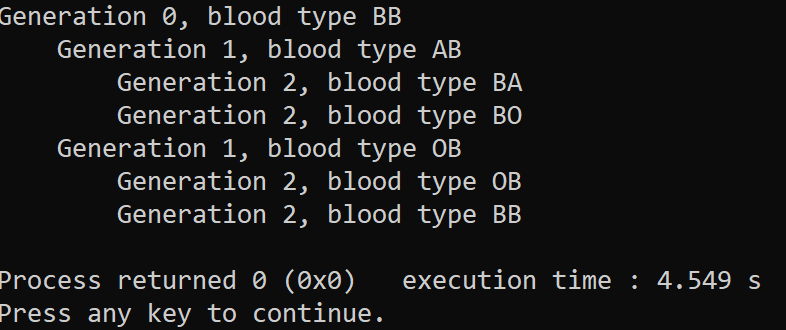
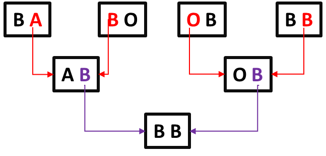
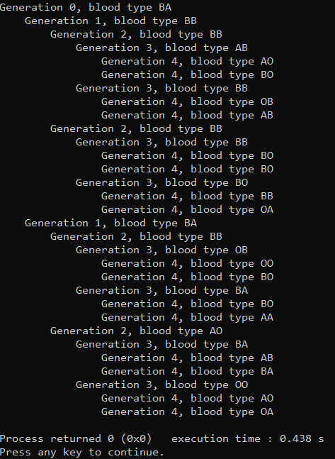

<h1>Simulating Blood Type Inheritance</h1>

<b>TASK:</b> Create an algorithm - in C language - able to simulate blood type inheritance for a certain number of generations.

<h2>Context:</h2>

The <a href="https://learn.genetics.utah.edu/content/basics/blood#:~:text=Blood%20Type%20Is%20Determined%20Genetically&text=A%20third%20version%20of%20this,alleles%20determines%20your%20blood%20type." target="_blank">blood type</a> of a person in determined genetically. We have two antigen molecules possible to be present on the surface of red blood cells (A or B), where they are present only if the person has the allele that encodes for the enzyme that makes that protein. Each person has two alleles that determine its blood type, one of them is received from our mother and the other one from our father. These alleles can be either A, B or O. While alleles A and B code for proteins A and B respectively, allele O codes for a protein that is not functional, so it does not make any antigen. When our two alleles are combined together, we can have 4 blood types:

<ul>
    <li>A - The person has only alleles to encode for protein A;</li> 
    <li>B - The person has only alleles to encode for protein B;</li>
    <li>AB - The person has both alleles that encode for each protein A and B, those are the called 'unversal recipients';</li>
    <li>O - The person has only 'O' alleles, so there is no antigen A nor B. Those are the called 'universal donnors';</li>
</ul>

<h2>Algorithm:</h2>
<ul>
<li><b>Struct Person -</b> each person on the generations will be stored as this struct, containing an array of pointers with 2 positions (*parents[2]), where each points to one of the person's parent or to NULL if there is no further generation. There's also an array of char with 2 positions (alleles[2]), where the alleles (A, B or O) of the person will be stored.</li>
<li><b>Assign alleles to a person -</b> If the person is the last of its group generation, its two alleles will be defined randomly by the <b>ramdom_allele</b> function, among all three possibilities (A, B or O). Otherwise the person's alleles will be set randomly too, but between the two alleles from each of the person's parents.</li>
<li><b>Function create_family -</b> it must allocate dinamically a pointer to a person 'p'. If the person is not on the last generation, we call the function again for both parents (it is like if we move up to the next generation). Since it is a recursive function, create_family will go up until the last generation, assign its alleles, and then return backward adding the alleles to the other generations, until it comes back to the first person. For each person we must asign its array of parents to point to the parents, and also define the person alleles.</li>
<li><b>Functions free and print -</b> The first one is called at the end of the code to free all memory allocated dinamically. The second one is used to print the result of the simulation on the terminal.</li>
</ul>

<h2>Output Examples:</h2>
 

For a generation set as 3, we have the following output.

 

The image below represents the results from result obtained using generation set as 3. However, since the alleles are chosen randomly, each run will output different results.

 

For a generation set as 5, we have the following output.

